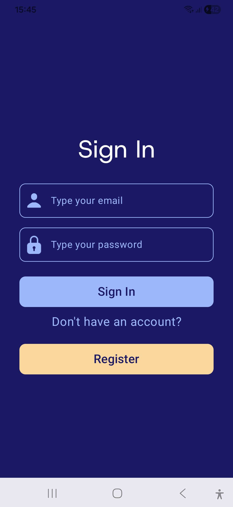
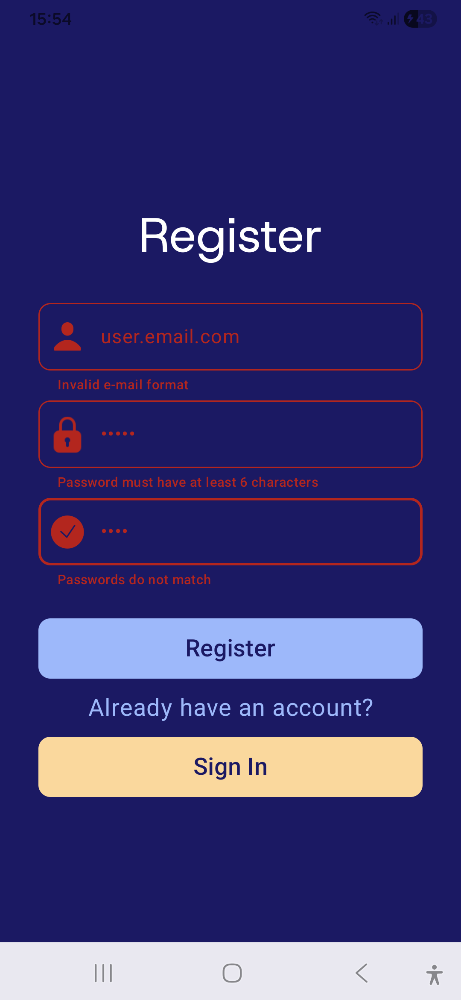
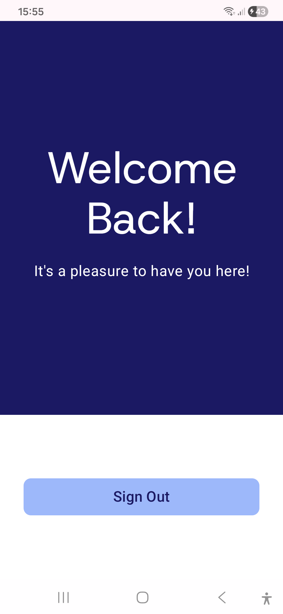

<h1 align="center">Login App </h1>

## Project 

This Android application is an authentication system that uses the Firebase Authentication tool. Besides, it also uses the Jetpack Compose toolkit for layout design. It allows users to log in and register using their email address and password.
## Layout 

  <table style="border-collapse: collapse; margin: 10px;">
    <tr>
      <td style="padding: 10px; text-align: center;">
        
      </td>
      <td style="padding: 10px; text-align: center;">
        
      </td>
      <td style="padding: 10px; text-align: center;">
        
      </td>
    </tr>
  </table>

## Technologies Used 

- **Programming Language:** Kotlin
- **Layout:** Jetpack Compose
- **Development Environment:** Android Studio
